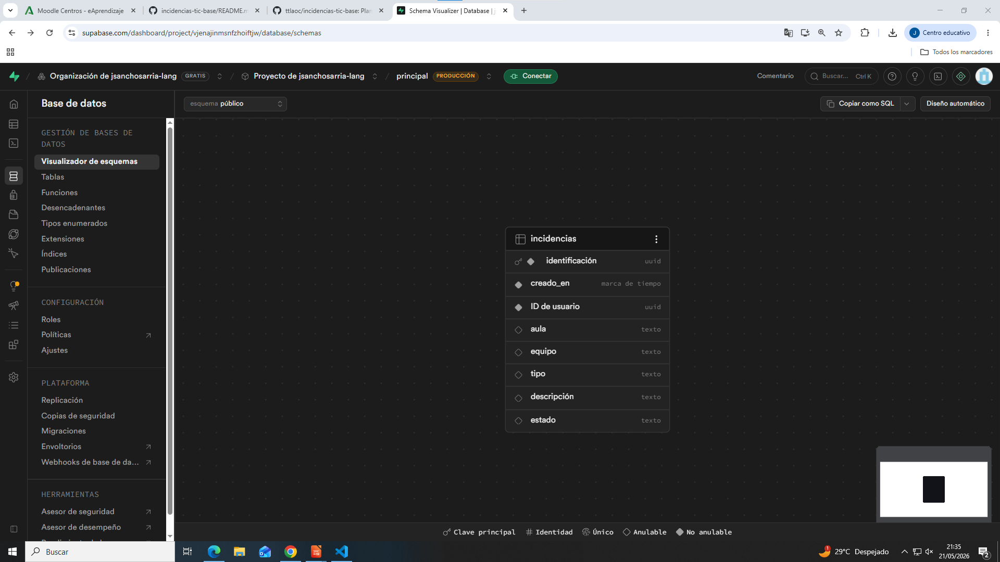
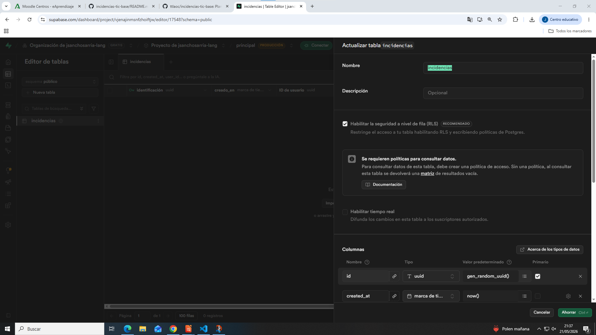
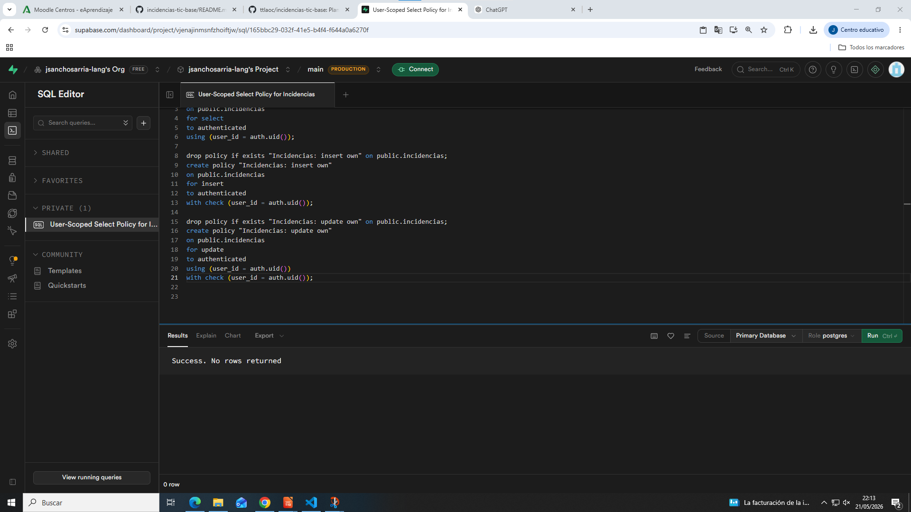

# Incidencias TIC (Cloud)

## Enlaces
- Repo: (pega aquí)
- GitHub Pages: (pega aquí)

## Evidencias (capturas)
<!-- Puedes añadir una imagen (captura de pantalla) del siguiente modo (sustituye "alt text" por un texto alternativo
para que tu documento gane accesibilidad. El ejemplo supone que las imágenes las guardas en la carpeta "res"):  -->
<!-- En Visual Studio Code puedes previsualizar un archivo markdown pulsando con botón derecho del ratón y seleccionando "Open preview"-->
1) Tabla `incidencias` (estructura):

2) RLS activado (se puede mirar en el editor de tablas de Supabase, pregunta a tu LLM favorito):

3) Policy (SELECT/INSERT/UPDATE) (se puede mirar donde mismo, pregunta a tu LLM favorito):

4) App funcionando (crear y listar):

5) App funcionando (cerrar incidencia):

## CE.f — Procedimiento de almacenaje cloud
- Servicio cloud usado: Supabase (Postgres + Auth + RLS)
- Estructura de tabla:
- Autenticación:
- Permisos (RLS + policies):
- Conexión desde la app (URL + ANON KEY, supabase-js):

## CE.g — Importancia del cloud (beneficios)
- Productividad: Permite acceder a aplicaciones, datos y servicios desde cualquier lugar con conexión a Internet.
- Seguridad: Suelen ofrecer medidas de seguridad como cifrado de datos, copias de seguridad automáticas, control de accesos y monitorización continua.
- Coste: Reduce la necesidad de comprar y mantener servidores propios e infraestructura física.
- Escalabilidad y disponibilidad: Los recursos se pueden ampliar o reducir, ademas permite que las aplicaciones y datos esten accesibles en todo momento.

## RA5 — Riesgos y medidas
### Riesgos (3)
1) Exposición de Datos Personales (PII): Introducir nombres de alumnos, teléfonos o DNI dentro del campo libre de descripción, infringiendo la normativa de protección de datos (RGPD) en un entorno educativo.
2) Fuga global de datos por fallo en RLS: Desactivar por error el aislamiento de filas (Row Level Security) en Supabase, lo que permitiría a cualquier usuario con conocimientos de consola leer o alterar las incidencias del resto del centro usando la clave pública.
3) Compromiso de credenciales de administración: Publicar por descuido la SERVICE_ROLE_KEY en un repositorio público de GitHub, otorgando control total e irrestricto sobre la base de datos a atacantes externos.

### Medidas (5)
1) Aplicación del principio de mínimo privilegio: Utilizar única y exclusivamente la ANON_KEY en el entorno frontend y restringir el comportamiento de las tablas mediante políticas explícitas en el servidor.
2) Anonimización técnica obligatoria: Prohibir terminantemente campos de texto libre con datos identificativos; las incidencias deben registrar únicamente el identificador físico (aula/equipo) y el síntoma técnico.
3) Validación y sanitización en el cliente (XSS): Implementar mecanismos de escape de caracteres HTML (escapeHtml) para neutralizar cualquier intento de inyección de código malicioso al renderizar las tablas dinámicas.
4) Auditoría continua de políticas RLS: Verificar que no existan permisos globales implícitos en la consola de Supabase y mantener las políticas de lectura/escritura vinculadas estrictamente a un ID autenticado (auth.uid()).
5) Uso de exclusiones de Git .gitignore: Asegurar que las credenciales sensibles del servidor o variables locales de configuración permanezcan fuera del historial de commits públicos del repositorio GitHub.